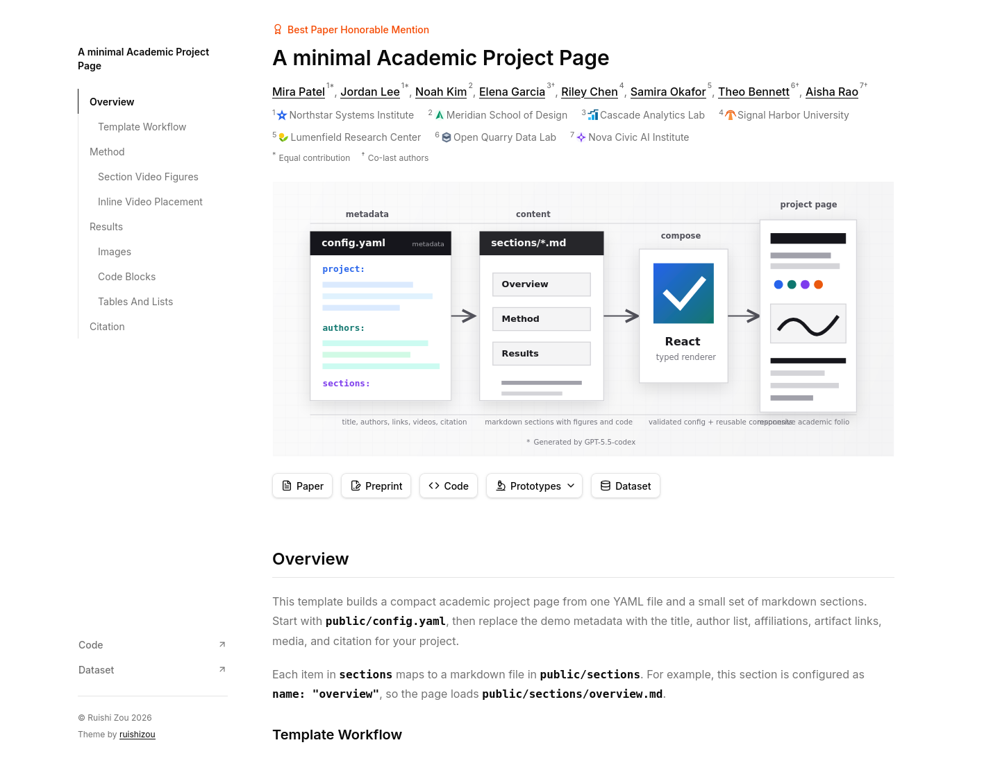

# Minimal Academic Project Page



> [!IMPORTANT]
> This repository is under construction and active development. The code of this repo is **largely generated by AI** and needs further code review, but its design is tightly guided by the author(s). To use this project, you **DO NOT** need a coding agent, and all functionalities needed should be in the `public` folder and could be used declaratively. The goal is to motivate human users to **manually author** the website content with ease.

---
*All content below is AI generated*

A React + TypeScript template for building a compact academic project page from `public/config.yaml` and markdown files in `public/sections`.

The page is intended for papers, demos, artifacts, datasets, and small research project sites. The React app owns the layout and components; project-specific content lives in YAML, markdown, and static assets.

## Features

- YAML-driven project header with award, title, authors, affiliations, teaser media, artifact links, citation, and copyright line.
- Left "On this page" navigation generated from configured sections and markdown headings.
- Important links rendered as shadcn buttons near the bottom of the left navigation.
- Author contribution markers defined once in YAML and reused by key.
- Affiliation rows with optional local SVG, WebP, PNG, or JPG icons.
- Standard link buttons with default Lucide icons plus custom `lucide-react` icon names for extra links.
- Markdown sections with GitHub-flavored markdown, tables, links, code blocks, images, captions, and responsive image widths.
- YouTube and local video figures, including autoplay, hidden controls, inline markdown insertion, and section-level insertion.
- Copyable BibTeX citation block with an overlay copy button.

## Project Structure

```text
public/config.yaml          # Project metadata and page configuration
public/sections/*.md        # Long-form markdown sections
public/images               # Teaser, figures, affiliation icons
public/videos               # Local video files
src/components              # Flat React component files
src/utils                   # Config, markdown, video, and navigation helpers
src/types                   # Shared TypeScript config types
```

Each item in `sections` maps to `public/sections/{name}.md`.

## Configuration

The main page is configured in `public/config.yaml`.

```yaml
project:
  title: "A minimal Academic Project Page"
  subtitle: "A configurable research page for publishing papers, demos, and artifacts."
  venue: "Conference on Human-Centered AI Systems 2026"
  award: "Best Paper Honorable Mention"
  abstract: "Short project summary for metadata and reuse."
  teaser:
    image: "/images/teaser.svg"
    alt: "Project teaser figure"

copyright: "© Ruishi Zou 2026"
```

The current header renders the award, title, authors, affiliations, teaser, and link buttons. `subtitle`, `venue`, and `abstract` are validated metadata fields available to the project configuration.

## Authors And Affiliations

Define contribution tags once, then reference them by key from authors.

```yaml
authorTags:
  co-first:
    marker: "*"
    label: "Equal contribution"
  co-last:
    marker: "†"
    label: "Co-last authors"

authors:
  - name: "Mira Patel"
    affiliation: "northstar"
    homepage: "https://example.com/mira-patel"
    tags:
      - "co-first"
  - name: "Jordan Lee"
    affiliation: "northstar"
```

Affiliations are matched by `id`. The `image` field is optional, so the layout also supports affiliations without icons.

```yaml
affiliations:
  - id: "northstar"
    name: "Northstar Systems Institute"
    image: "/images/affiliations/northstar.svg"
    url: "https://example.com"
```

## Links

Standard link slots get default Lucide icons:

- `paper`
- `preprint`
- `code`
- `prototypes`

```yaml
links:
  paper:
    href: "https://example.com/paper.pdf"
  preprint:
    href: "https://example.com/preprint.pdf"
  code:
    href: "https://github.com/example/project"
    important: true
  prototypes:
    items:
      - label: "Interactive Demo"
        href: "https://example.com/demo"
      - label: "Artifact Browser"
        href: "https://example.com/artifacts"
```

Add custom links with `extras`. The `icon` value should match a `lucide-react` icon name.

```yaml
links:
  extras:
    - label: "Dataset"
      href: "https://example.com/dataset"
      icon: "Database"
      important: true
    - label: "DOI"
      href: "https://doi.org/10.0000/example"
      icon: "BadgeCheck"
```

Set `important: true` on a direct link or a dropdown item to show it in the left navigation near the footer. Important links render as full-width shadcn buttons with a Lucide arrow icon. If `important: true` is set on a dropdown parent, all of its child items are shown in that bottom link list.

## Sections And Navigation

Configure sections in YAML:

```yaml
sections:
  - name: "overview"
    title: "Overview"
  - name: "method"
    title: "Method"
  - name: "results"
    title: "Results"
```

Then create matching markdown files:

```text
public/sections/overview.md
public/sections/method.md
public/sections/results.md
```

The left navigation includes each configured section and the headings inside each markdown file. The first heading in a markdown file is treated as the section heading; later headings become nested tracker items.

## Markdown Images

Regular markdown image syntax works:

```md

```

Use the markdown image title as a centered caption:

```md

```

Use `#width=` or `#w=` to set desktop width. Narrow images are centered and become full width on smaller screens.

```md


```

Relative image paths resolve from the markdown file. Paths that start with `public/` are converted to root-relative public URLs.

## Videos

Define reusable videos in `public/config.yaml`.

```yaml
videos:
  - id: "project-presentation"
    title: "Project Presentation"
    provider: "youtube"
    url: "https://www.youtube.com/watch?v=RvreULjnzFo"
  - id: "video-teaser"
    title: "Project Showcase Mockup"
    provider: "local"
    file: "project_showcase.mp4"
    autoplay: true
    hideProgressBar: true
```

Local files belong in `public/videos`. `file: "project_showcase.mp4"` resolves to `/videos/project_showcase.mp4`. You can also provide `url` for an explicit local or remote video URL.

Supported video fields:

- `provider`: `"youtube"` or `"local"`.
- `url`: YouTube URL, embed URL, or explicit video URL.
- `file`: local file name for videos in `public/videos`.
- `autoplay`: starts the figure automatically. Local autoplay videos are muted and use `playsInline`.
- `hideProgressBar`: hides YouTube controls and renders local videos without native controls.
- `aspectRatio`: optional ratio like `"16/9"` or `"4/3"`. Local videos use their intrinsic aspect ratio when this is omitted.

Attach videos after a section:

```yaml
sections:
  - name: "method"
    title: "Method"
    videos:
      - "video-teaser"
```

Insert a video inline inside markdown by placing the directive on its own line:

```md
{{ video: video-teaser }}
```

## Citation

The `citation` block is optional. When provided, it renders a BibTeX code block with an overlay copy button.

```yaml
citation:
  title: "BibTeX"
  text: "Optional paragraph shown before the BibTeX block. Remove this field to hide the paragraph."
  label: "Project 2026"
  bibtex: |
    @inproceedings{project2026,
      title = {Project Title},
      author = {Patel, Mira and Lee, Jordan},
      year = {2026}
    }
```

`title` and `text` are optional. If `title` is omitted, the app uses `Citing these materials`. If `text` is omitted, no intro paragraph is rendered.

## Development

Install dependencies and run the app with pnpm:

```bash
pnpm install
pnpm run dev
```

Useful scripts:

```bash
pnpm run lint
pnpm run build
pnpm run preview
```

The app uses React, TypeScript, Vite, Tailwind CSS, shadcn UI components, `lucide-react`, `react-markdown`, `remark-gfm`, and `yaml`.

## Development Notes

- Keep project content in `public/config.yaml`, markdown files, and public assets whenever possible.
- Use shadcn components from `src/components/ui` as-is. Add project-specific components under `src/components`.
- Use Lucide icons instead of hand-written SVG icons for UI controls.
- Use Tailwind CSS for styling.

## Inspiration

This project is inspired by [orderedlist/minimal](https://github.com/orderedlist/minimal) and [ritesh-kanchi/axya](https://github.com/ritesh-kanchi/axya).
